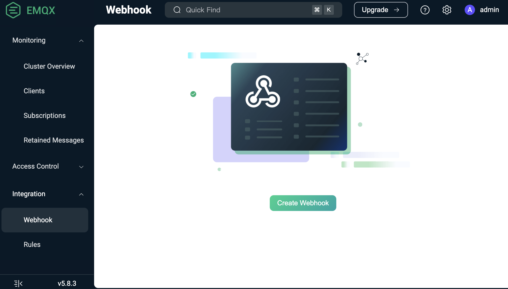
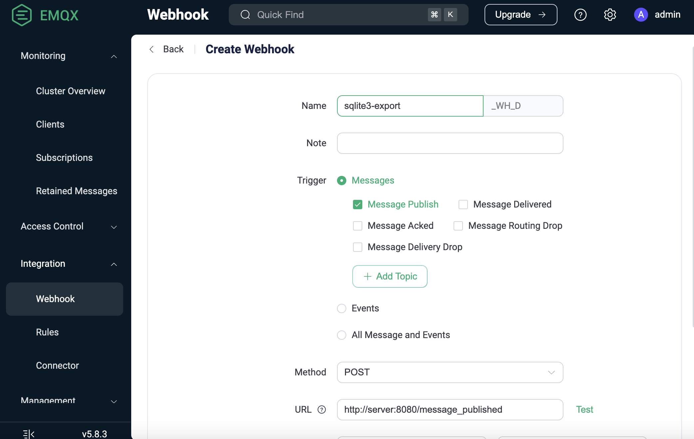
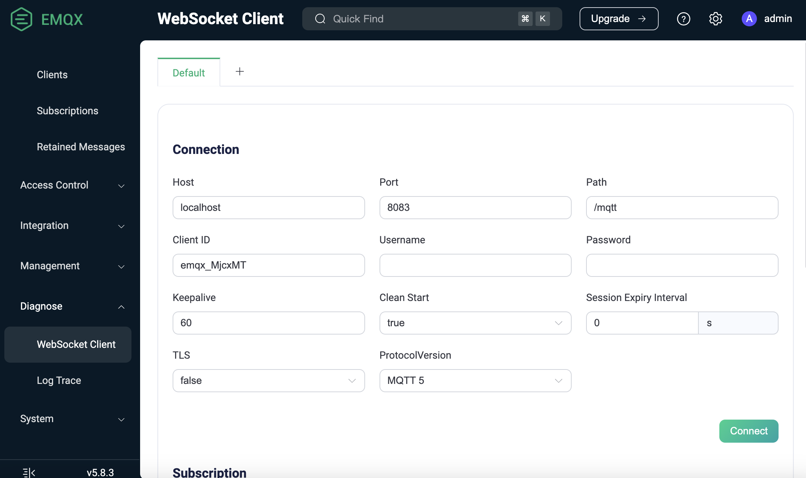

# MQTT to SQLite

This article will show how to store MQTT data in an SQLite database.

## What is MQTT?

[MQTT](https://mqtt.org) is a lightweight messaging protocol that is used to send messages between devices. Among its key features are:
* MQTT is an application layer protocol. It runs over a variety of transports, like TCP, TLS, and WebSockets.
* Communication via MQTT requires a broker. The broker is responsible for routing messages between clients.
* MQTT is publish/subscribe based. It uses topics to send messages. Clients can subscribe to topics to receive messages and may publish messages to topics. This makes the communication asynchronous and flexible.
* MQTT is lightweight and simple. It has low overhead and is easy to implement. There are a lot of libraries available for different languages.

These features make MQTT popular for IoT applications. The general use case is to have a number of devices that report some measurements to relevant topics and receive commands from other topics.

## What is SQLite?

[SQLite](https://www.sqlite.org/index.html) is probably [the most widely deployed SQL database](https://www.sqlite.org/mostdeployed.html) engine in the world.

* SQLite is serverless. The database engine is embedded in the application, and the database is stored in a local file. This makes SQLite extremely easy to deploy and use.
* SQLite is thoroughly tested.
* SQLite provides many relational database features.
* There are many libraries available for different languages. SQLite is even supported by Python's standard library.

## Storing MQTT data in SQLite

MQTT brokers may provide reach functionality, but their basic use case is to route messages between clients. To make complex processing of the data provided by some kind of devices, an export pipeline is normally set up. The MQTT data from messages is exported to a database to be processed and analyzed.

SQLite is often a desirable choice for this purpose because of its simplicity and ease of use. This article will show how to store MQTT data in SQLite database.

## Common Scenarios for MQTT to SQLite Integration

We should note that although SQLite is a great choice for many applications, it is not suitable for all scenarios.

SQLite is a serverless database running on a single machine, so SQLite is not suitable for applications that require high availability or operate with large amounts of data.

However, SQLite is a great choice for many applications with moderate load. Since the database is a single file, it may be easily backed up, exported, and analyzed.

## Step-by-Step Guide on MQTT to SQLite Integration

To demonstrate an integration of MQTT and SQLite, we use the following tools:
* [EMQX](https://www.emqx.io) as MQTT broker.
* [EMQX Webhooks](https://docs.emqx.com/en/emqx/latest/data-integration/webhook.html) feature to send MQTT messages to an HTTP endpoint.
* [Python](https://www.python.org) with [Flask](https://flask.palletsprojects.com) to receive messages from EMQX Webhooks.

We will consider the following scenario:
* There are some devices around that connect to the MQTT brokers.
* The devices report some measurements to the MQTT broker. They send simple JSON messages in the form `{"temperature": 25.5}` to the topic `sensor/{sensor_id}/data`.
* The broker exports these messages to an HTTP endpoint.
* The HTTP endpoint is a Flask application that receives the messages and stores the measurements in an SQLite database.

This article's assets and code are available in the [GitHub repository](https://github.com/savonarola/emqx-sqlite3-export.git).

### Develop the database schema

We use a simple table for measurements:

```sql
CREATE TABLE IF NOT EXISTS measurements (
    id INTEGER PRIMARY KEY AUTOINCREMENT,
    sensor_id STRING NOT NULL,
    temperature REAL NOT NULL,
    -- unix timestamp in seconds
    created_at INTEGER NOT NULL
);
```

We keep it in a file [`schema.sql`](schema.sql).

### Develop an initialization script

When we run our setup (locally or in a cloud), we need to create the database and the table. We use a simple Python script [`init_db.py`](init_db.py) for this:

```python
import os
import sqlite3
import sys

db_file = os.environ.get('DB_FILE')
if db_file is None:
    sys.exit("DB_FILE environment variable must be set")

connection = sqlite3.connect(db_file)

with open('schema.sql') as f:
    connection.executescript(f.read())

connection.close()
```

### Develop a Flask application

EMQX exports MQTT messages to an HTTP endpoint as JSON messages. The format of the messages may be configured, but in the default configuration, these messages have the following fields that are important for us:

```js
{
  "event": "message.publish",
  "payload": "{\"temeperature\": 25.5}",
  "topic": "t/a",
  "publish_received_at": 1734099263448
  // ...
}
```

Let us extract the sensor ID, temperature, and timestamp from the message and store them in the database.

We use Flask to receive messages from EMQX Webhooks and store them in the database. The Flask application is in the file [`app.py`](app.py).

```python
import json
import os
import sqlite3
import sys

from flask import Flask, Response, request

db_file = os.environ.get('DB_FILE')
if db_file is None:
    sys.exit("DB_FILE environment variable must be set")

app = Flask(__name__)


@app.route('/message_published', methods=['POST'])
def message_published():
    data = request.get_json()

    sensor_id = sensor_id_from_topic(data["topic"])
    if sensor_id is None:
        # Just ignore messages that don't match the expected
        # topic format: sensor/<sensor_id>/data
        return Response(status=200)

    paylaod = json.loads(data["payload"])
    temperature = paylaod["temperature"]
    created_at = data["publish_received_at"] // 1000

    conn = sqlite3.connect(db_file)
    conn.execute(
        "INSERT INTO measurements(sensor_id, temperature, created_at) "
        "VALUES (?, ?, ?)",
        (sensor_id, temperature, created_at)
    )
    conn.commit()
    conn.close()
    return Response(status=200)


def sensor_id_from_topic(topic):
    segments = topic.split('/', 3)
    if len(segments) < 3 or segments[0] != "sensor" or segments[2] != "data":
        return None
    return segments[1]
```

Some notes:
* We extract sensor_id from the topic. The topic is in the form `sensor/{sensor_id}/data`. We gracefully ignore messages that don't match this topic format.
* We extract the temperature from the JSON payload.
* For simplicity, we connect to the database for each request. Since this is local access to a file, it is cheap for low loads. For higher loads, we should consider using constant connections.

### Run the Flask application
We use `gunicorn` to run the Flask application:

```bash
gunicorn --bind 0.0.0.0:8080 --access-logfile '-' app:app
```

We may run everything locally, but we prefer to make a Dockerized setup for better reproducibility and easier further deployment. We need [Docker](https://www.docker.com) and [Docker Compose](https://docs.docker.com/compose/) to be installed for this.

We use the following [`Dockerfile`](Dockerfile):

```Dockerfile
FROM ubuntu:24.04

RUN apt-get update
RUN apt-get install -y \
 python3 \
 python3-flask \
 gunicorn

ADD . /app
WORKDIR /app

CMD ["/usr/bin/gunicorn", "--bind", "0.0.0.0:8080", "--threads", "16",  "--access-logfile", "-", "app:app"]
```

Now let us tie everything together with a [`docker-compose-simple.yml`](docker-compose-simple.yml):

```yaml
services:
  emqx:
    image: emqx:5.8.3
    ports:
      - "1883:1883"
      - "8083:8083"
      - "8084:8084"
      - "8081:8081"
      - "18083:18083"

  server:
    build:
      dockerfile: Dockerfile
    ports:
      - "8080:8080"
    volumes:
      - ./db:/db
    environment:
      DB_FILE: /db/db.sqlite
    depends_on:
      server_init:
        condition: service_completed_successfully

  server_init:
    build:
      dockerfile: Dockerfile
    volumes:
      - ./db:/db
    environment:
      DB_FILE: /db/db.sqlite
    command:
      - /usr/bin/python3
      - init_db.py
```

* We initialize the database with the `server_init` service. We will wait for it to be completed before starting the Webhooks server.
* We use a host folder `./db` to store the SQLite database. This way, the database is persistent between container restarts. In a cloud setup, we would use mounted volumes for this purpose.
* We expose EMQX ports for MQTT, Websockets, and Dashboard.

### Run the setup

We run the setup with the following command:

```bash
docker compose -f docker-compose-simple.yml up
```

We should see someting like this:

```
...
server_init-1 exited with code 0
server-1       | [2024-12-13 16:03:02 +0000] [1] [INFO] Starting gunicorn 20.1.0
server-1       | [2024-12-13 16:03:02 +0000] [1] [INFO] Listening at: http://0.0.0.0:8080 (1)
...
emqx-1         | EMQX 5.8.3 is running now!
```

### Set up EMQX Webhooks

First, we visit the EMQX Dashboard at [http://localhost:18083](http://localhost:18083) and log in with the default credentials `admin`/`public`.

Then, navigate to the Integration -> Webhooks section and add a new Webhook:



Press "Create Webhook". We need to fill only tho fields:

* Name: `sqlite3-export` (or any other name you like).
* URL: `http://server:8080/message_published`.



Press "Save".

### Test the setup

EMQX Broker has a quite powerful Websocket client built in. In the EMQX Dashboard, navigate to the WebSocket client: Diagnose -> WebSocket Client.



Press "Connect". You should see a notification that the connection is established. Now we have a connected client. Let's emulate sending measurements from a device.

* Go to the publish section.
* Set the topic to `sensor/s1/data`.
* Set the payload to `{"temperature": 25.5}`.
* Press "Publish".

You may change the topic to `sensor/s2/data` and send more messages.

Now, let us check the database. We may use the `sqlite3` command line tool (installed locally):

```bash
>sqlite3 db/db.sqlite
SQLite version 3.43.2 2023-10-10 13:08:14
Enter ".help" for usage hints.
sqlite> select * from measurements;
1|s1|25.5|1734112395
2|s3|25.5|1734112417
3|s6|25.5|1734112421
4|s6|26.5|1734112568
5|s6|40.0|1734112572
6|s7|15.0|1734112581
sqlite>
```

We see that the measurements are stored in the database.

## Extended Scenarios

### Aggregating Measurements

Having the data exported to an SQLite database, we may perform more complex queries on the data. For example, let's select the maximum day's temperature for each sensor and each day:

```sql
SELECT
    sensor_id,
    DATE(created_at, 'unixepoch', 'localtime') AS date,
    MAX(temperature) AS max_temperature
FROM measurements
GROUP BY
    sensor_id,
    date
ORDER BY
    date;
```


```bash
>sqlite3 db/db.sqlite
SQLite version 3.43.2 2023-10-10 13:08:14
Enter ".help" for usage hints.
sqlite> SELECT
 ...>     sensor_id,
 ...>     DATE(created_at, 'unixepoch', 'localtime') AS date,
 ...>     MAX(temperature) AS max_temperature
 ...> FROM measurements
 ...> GROUP BY
 ...>     sensor_id,
 ...>     date
 ...> ORDER BY
 ...>     date;
s1|2024-12-13|25.5
s3|2024-12-13|25.5
s6|2024-12-13|40.0
s7|2024-12-13|15.0
```

### Data backup

SQLite database is a single file. So, it is easy to back up the database by copying or uploading the file. For example, having [`s3cmd`](https://s3tools.org/s3cmd) tool installed and set up, we may upload the database to an S3 bucket with a single command:

```bash
s3cmd put db/db.sqlite "s3://mybucketforbackup/$(date +%Y-%m-%d_%H-%M-%S)/db.sqlite"
```

### Immutable configuration

Although EMQX has a very powerful Dashboard, often it is not suitable to configure the broker manually, e.g., if we have some automated deployment.

One of the ways is to configure the export rule with environment variables. See `docker-compose-full.yml` for an example:

```yaml
services:
  emqx:
    image: emqx:5.8.3
    ports:
      - "1883:1883"
      - "8083:8083"
      - "8084:8084"
      - "8081:8081"
      - "18083:18083"
    environment:
      # connector, `sqlite_export` is our custom connector's name
      EMQX_connectors__http__sqlite_export__url: "http://server:8080/message_published"
      EMQX_connectors__http__sqlite_export__enable: true
      # action, `sqlite_export` is our custom action's name
      EMQX_actions__http__sqlite_export__connector: sqlite_export
      EMQX_actions__http__sqlite_export__enable: true
      EMQX_actions__http__sqlite_export__parameters__method: post
      # export rule, `sqlite_export` is our custom rule's name
      EMQX_rule_engine__rules__sqlite_export__actions__1: http:sqlite_export
      EMQX_rule_engine__rules__sqlite_export__enable: true
      EMQX_rule_engine__rules__sqlite_export__sql: 'SELECT * FROM "#"'
  server:
    ...
```

Note that in this case, the configured Webhook will not be seen in the Integration -> Webhooks section of the Dashboard because we didn't use the simplified interface. All the settings may be seen in the Integration -> Rules and Integration -> Connector sections.

Also, EMQX may be configured with a configuration file. See relevant [documentation](https://docs.emqx.com/en/emqx/latest/deploy/install.html).

## Conclusion

In this article, we have seen how to store MQTT data in an SQLite database using EMQX. Although SQLite does not provide a network interface, using EMQX features, we managed to set up an export pipeline quickly.

If you have a setup with a limited number of IoT devices, consider using SQLite to store the data. It may be an excellent choice for many applications.

